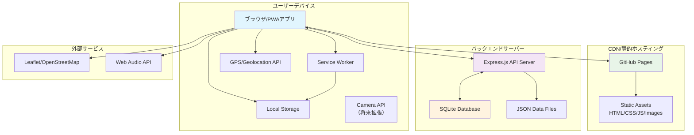
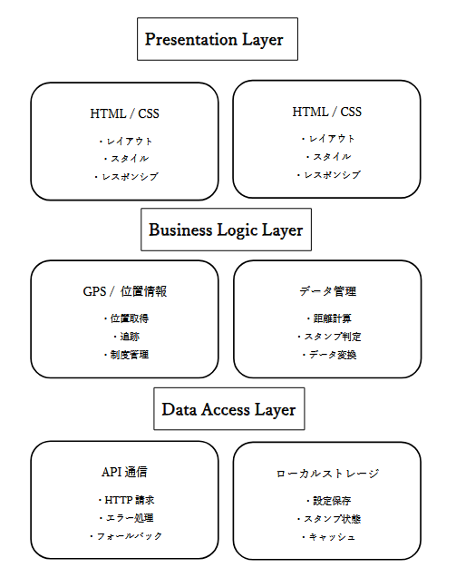
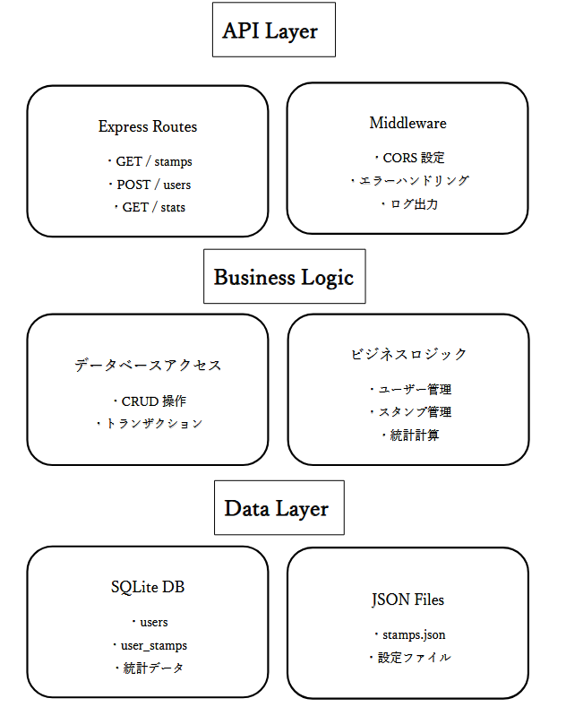
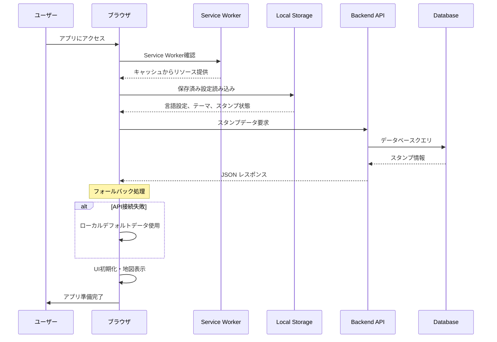
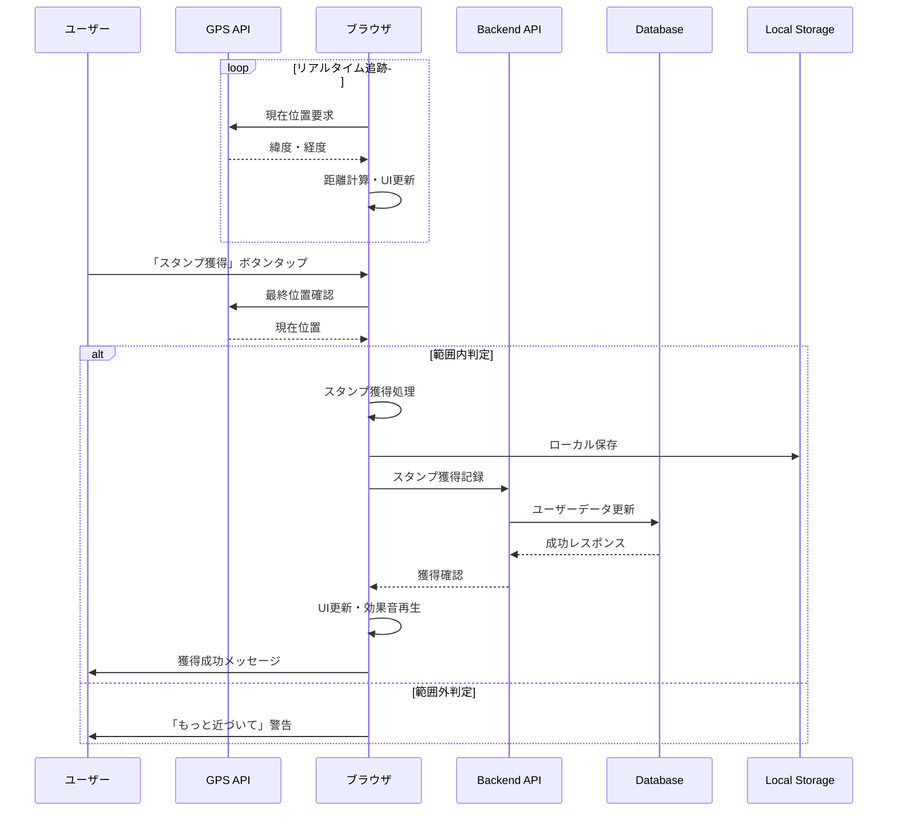
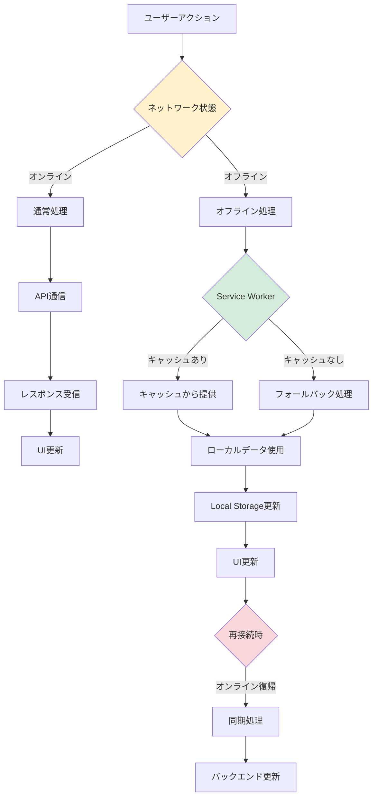
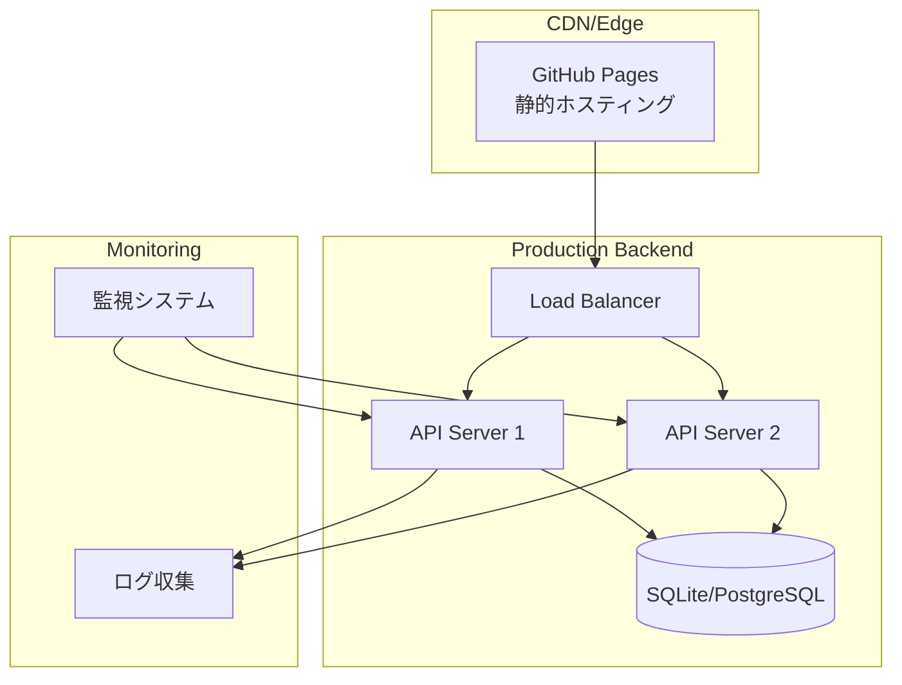
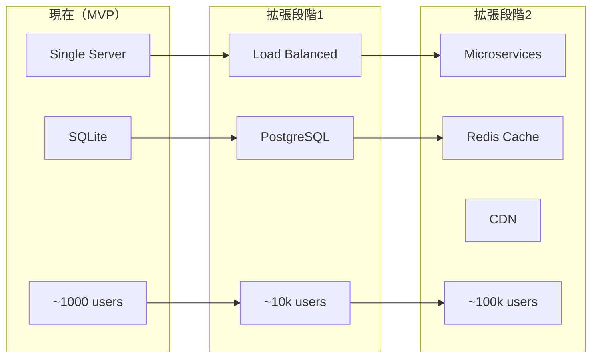

# システム構成とファイル構造

## 📋 目次

1. [システム概要](#1-システム概要)
2. [技術アーキテクチャ](#2-技術アーキテクチャ)
3. [詳細ファイル構成](#3-詳細ファイル構成)
4. [データフロー](#4-データフロー)
5. [API通信フロー](#5-api通信フロー)
6. [パフォーマンス考慮事項](#6-パフォーマンス考慮事項)

---

## 1. システム概要

本アプリケーションは、**フロントエンド（SPA）**　と　**バックエンド（API サーバー）**が分離されたモダンなWebアプリケーション構成を採用しています。PWA（Progressive Web App）として動作し、オフライン機能も提供します。

### 1.1 システム構成図



### 1.2 主要コンポーネント

| コンポーネント | 技術 | 役割 | ホスティング |
|---------------|------|------|-------------|
| **フロントエンド** | HTML/CSS/JavaScript | UI/UX、GPS処理、地図表示 | GitHub Pages |
| **バックエンド** | Node.js + Express.js | API提供、データ管理 | Heroku/Railway |
| **データベース** | SQLite | ユーザーデータ、統計情報 | バックエンドサーバー |
| **地図サービス** | Leaflet.js + OpenStreetMap | インタラクティブマップ | CDN |
| **PWA機能** | Service Worker | オフライン対応、キャッシュ | ブラウザ |

---

## 2. 技術アーキテクチャ

### 2.1 フロントエンド アーキテクチャ




### 2.2 バックエンド アーキテクチャ



---

## 3. 詳細ファイル構成

### 3.1 プロジェクト全体構造

```
Okayama_GPS_RALLY/
├── 📁 backend/                           # バックエンドAPI
│   ├── 📁 src/                          # TypeScriptソースコード
│   │   ├── 📄 server.ts                 # メインサーバーファイル
│   │   ├── 📄 database.ts               # データベースアクセス層
│   │   └── 📁 models/                   # データモデル
│   │       ├── 📄 User.js               # ユーザーモデル
│   │       └── 📄 UserStamp.js          # ユーザースタンプモデル
│   │
│   ├── 📁 data/                         # データファイル
│   │   ├── 📄 stamps.json               # スタンプポイントデータ
│   │   └── 📄 stamps.db                 # SQLiteデータベース（実行時生成）
│   │
│   ├── 📁 dist/                         # TypeScriptビルド成果物
│   │   └── 📄 server.js                 # コンパイル済みJS
│   │
│   ├── 📄 package.json                  # 依存関係・スクリプト定義
│   ├── 📄 tsconfig.json                 # TypeScript設定
│   └── 📄 .env.example                  # 環境変数テンプレート
│
├── 📁 docs/                             # フロントエンド（GitHub Pages用）
│   ├── 📄 index.html                    # メインHTML（PWA Manifest含む）
│   ├── 📄 script.js                     # 全体ロジック（2500行以上）
│   ├── 📄 style.css                     # 全体スタイル（レスポンシブ対応）
│   ├── 📄 sw.js                         # Service Worker（オフライン機能）
│   ├── 📄 manifest.json                 # PWA設定ファイル
│   │
│   ├── 📁 images/                       # 画像リソース
│   │   ├── 🖼️ background.jpg           # メイン背景画像
│   │   ├── 🖼️ location-0.jpg           # 西古松南部公園
│   │   ├── 🖼️ location-1.png           # 大元公園
│   │   ├── 🖼️ location-2.jpg           # 岡山城
│   │   ├── 🖼️ location-3.jpg           # 岡山後楽園
│   │   ├── 🖼️ メイン画面.png           # スクリーンショット
│   │   ├── 🖼️ 獲得前.png               # UI状態デモ
│   │   └── 🖼️ 獲得後.png               # UI状態デモ
│   │
│   ├── 📁 icons/                        # PWA用アイコン
│   │   ├── 🎯 icon-192.png             # PWAアイコン（小）
│   │   └── 🎯 icon-512.png             # PWAアイコン（大）
│   │
│   └── 📁 Sounds/                       # オーディオファイル
│       └── 🎵 BGM.mp3                  # 背景音楽・効果音
│
├── 📄 README.md                         # プロジェクト概要・使用方法
├── 📄 ARCHITECTURE.md                   # システム構成詳細（本ファイル）
├── 📄 API_SPEC.md                       # API仕様書
└── 📄 企画設計書.md                     # プロジェクト企画・設計背景
```

### 3.2 ファイル詳細説明

#### 🎯 主要ファイル

| ファイル | 役割 | サイズ目安 | 重要度 |
|---------|------|-----------|--------|
| `docs/script.js` | フロントエンドメインロジック | 2500+ 行 | ★★★★★ |
| `docs/style.css` | 全体スタイル・レスポンシブ | 800+ 行 | ★★★★☆ |
| `backend/src/server.ts` | Express APIサーバー | 300+ 行 | ★★★★★ |
| `backend/src/database.ts` | DB操作・データ管理 | 400+ 行 | ★★★★☆ |
| `docs/sw.js` | PWA・オフライン機能 | 150+ 行 | ★★★☆☆ |

#### 🎨 スタイル構成

```css
/* style.css の構成 */
:root { /* CSS変数定義 */ }
* { /* リセットCSS */ }

/* === コンポーネント別スタイル === */
.header { /* ヘッダー・進捗表示 */ }
.nav-tabs { /* ナビゲーションタブ */ }
.location-card { /* スタンプ地点カード */ }
.collection-grid { /* コレクション表示 */ }

/* === ユーティリティ === */
.debug-controls { /* デバッグ機能 */ }
.language-selector { /* 多言語切り替え */ }

/* === レスポンシブ === */
@media (max-width: 768px) { /* モバイル対応 */ }
@media (max-width: 480px) { /* 小型デバイス対応 */ }

/* === ダークモード === */
[data-theme="dark"] { /* ダークテーマ */ }
```

#### 🔧 JavaScript構成

```javascript
// script.js の主要機能構成

/* === グローバル変数・設定 === */
const BACKEND_URL = 'http://localhost:3000';
let currentPosition = null;
let locations = [];

/* === 初期化・セットアップ === */
function initializeApp() { /* アプリ初期化 */ }
function loadStampData() { /* スタンプデータ読み込み */ }
function setupEventListeners() { /* イベントリスナー設定 */ }

/* === GPS・位置情報 === */
function startGPSTracking() { /* GPS追跡開始 */ }
function calculateDistance() { /* 距離計算（Haversine） */ }
function updateDistances() { /* 距離表示更新 */ }

/* === スタンプ機能 === */
function checkLocation(locationId) { /* スタンプ獲得判定 */ }
function collectStamp(locationId) { /* スタンプ獲得処理 */ }
function updateProgress() { /* 進捗更新 */ }

/* === UI・画面制御 === */
function switchTab(tabName) { /* タブ切り替え */ }
function updateLocationCards() { /* カード表示更新 */ }
function showCollectionCards() { /* コレクション表示 */ }

/* === 多言語・テーマ === */
function changeLanguage() { /* 言語切り替え */ }
function toggleTheme() { /* ダークモード切り替え */ }

/* === 地図機能 === */
function initializeMap() { /* Leaflet地図初期化 */ }
function updateMapMarkers() { /* マーカー更新 */ }

/* === データ管理 === */
function saveToLocalStorage() { /* ローカル保存 */ }
function loadFromLocalStorage() { /* ローカル読み込み */ }
function syncWithBackend() { /* バックエンド同期 */ }
```

---

## 4. データフロー

### 4.1 アプリケーション起動フロー



### 4.2 スタンプ獲得フロー



### 4.3 オフライン動作フロー



---

## 5. デプロイメント構成

### 5.1 本番環境アーキテクチャ



### 5.2 環境別構成

| 環境 | フロントエンド | バックエンド | データベース | 用途 |
|------|-------------|------------|-------------|------|
| **開発** | localhost:8080 | localhost:3000 | SQLite | 開発・テスト |
| **ステージング** | GitHub Pages | Heroku/Railway | SQLite | 統合テスト |
| **本番** | GitHub Pages | AWS/GCP | PostgreSQL | 一般ユーザー |

### 5.3 CI/CD パイプライン

```yaml
# .github/workflows/deploy.yml（概念図）
name: Deploy
on:
  push:
    branches: [main]

jobs:
  frontend:
    runs-on: ubuntu-latest
    steps:
      - uses: actions/checkout@v3
      - name: Deploy to GitHub Pages
        run: # 自動デプロイ
        
  backend:
    runs-on: ubuntu-latest
    steps:
      - uses: actions/checkout@v3
      - name: Build TypeScript
        run: npm run build
      - name: Deploy to Railway
        run: # 自動デプロイ
```

---

## 6. パフォーマンス・セキュリティ

### 6.1 パフォーマンス最適化戦略

#### フロントエンド最適化
```javascript
// GPS更新の最適化
const GPS_CONFIG = {
    enableHighAccuracy: true,
    timeout: 10000,
    maximumAge: 30000  // 30秒キャッシュ
};

// 関数のスロットリング
const throttledUpdate = throttle(updateDistances, 2000);

// 画像遅延読み込み
const imageObserver = new IntersectionObserver((entries) => {
    entries.forEach(entry => {
        if (entry.isIntersecting) {
            const img = entry.target;
            img.src = img.dataset.src;
            imageObserver.unobserve(img);
        }
    });
});
```

#### Service Workerキャッシュ戦略
```javascript
// キャッシュ戦略の定義
const CACHE_STRATEGIES = {
    static: 'cache-first',      // HTML,CSS,JS
    images: 'cache-first',      // 画像ファイル
    api: 'network-first',       // API通信
    fallback: 'stale-while-revalidate'  // フォールバック
};
```

### 6.2 セキュリティ対策

#### バックエンドセキュリティ
```typescript
// レート制限
const rateLimiter = rateLimit({
    windowMs: 15 * 60 * 1000, // 15分
    max: 100,                 // 最大100リクエスト
    message: 'Too many requests'
});

// CORS設定
const corsOptions = {
    origin: process.env.CORS_ORIGINS?.split(',') || [],
    credentials: true,
    optionsSuccessStatus: 200
};

// 入力値検証
const validateStampData = [
    body('location.lat').isFloat({min: -90, max: 90}),
    body('location.lng').isFloat({min: -180, max: 180}),
    body('stampId').isInt({min: 0})
];
```

#### フロントエンドセキュリティ
- **Content Security Policy (CSP)** 実装
- **XSS対策** - DOMPurifyライブラリ使用検討
- **データ検証** - 位置情報の妥当性確認
- **プライバシー保護** - 個人識別情報の最小化

### 6.3 監視・運用項目

| 項目 | 目標値 | 監視方法 | アラート条件 |
|------|--------|----------|-------------|
| **応答時間** | < 1秒 | APM | > 3秒で警告 |
| **可用性** | 99.9% | Uptime監視 | 5分以上ダウン |
| **エラー率** | < 1% | ログ監視 | > 5%で警告 |
| **GPS精度** | 90%以上 | アプリ内統計 | 週次レポート |

### 6.4 データバックアップ戦略

```bash
# 自動バックアップスクリプト例
#!/bin/bash
# データベースバックアップ
sqlite3 /app/data/stamps.db ".backup /backups/stamps_$(date +%Y%m%d_%H%M%S).db"

# ログファイルローテーション
find /app/logs -name "*.log" -mtime +7 -delete

# 統計データエクスポート
curl -s http://localhost:3000/api/stats > /backups/stats_$(date +%Y%m%d).json
```

---

## 💡 技術選定の理由

### アーキテクチャ選定理由

| 技術 | 選定理由 | 代替案 |
|------|----------|--------|
| **HTML/CSS/JS** | 軽量・高速、PWA対応 | React, Vue.js |
| **Express.js** | シンプル、Node.js生態系 | FastAPI, Spring Boot |
| **SQLite** | 軽量、ファイルベース | PostgreSQL, MySQL |
| **GitHub Pages** | 無料、簡単デプロイ | Vercel, Netlify |
| **Leaflet.js** | オープンソース、軽量 | Google Maps, Mapbox |

### スケーラビリティ考慮



