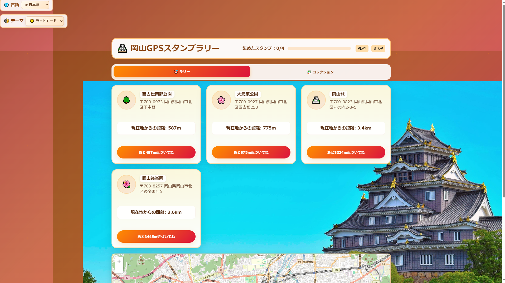
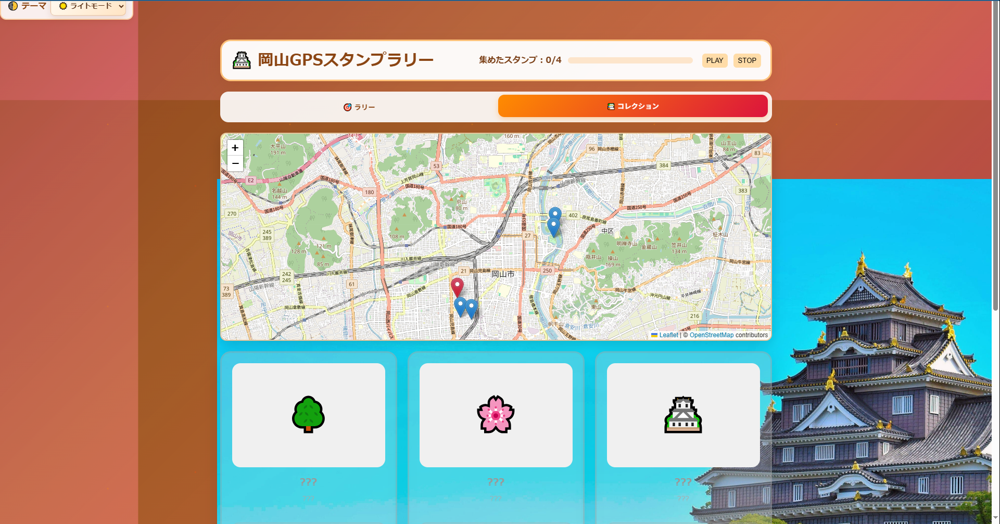
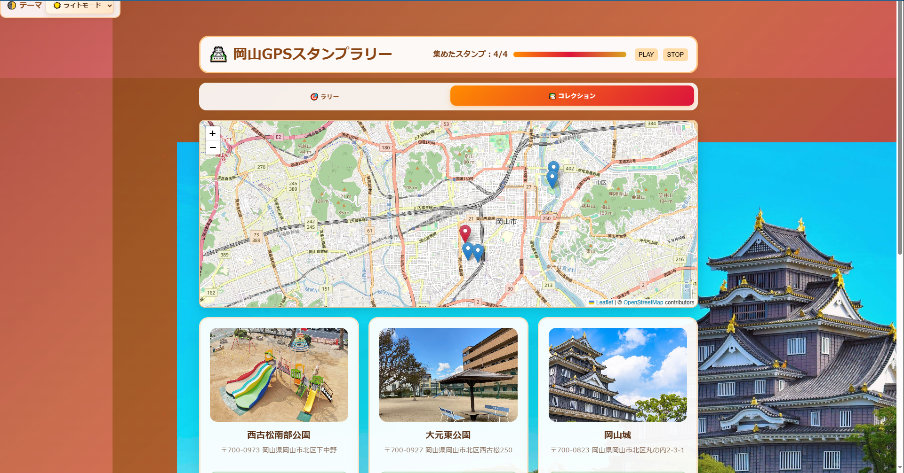
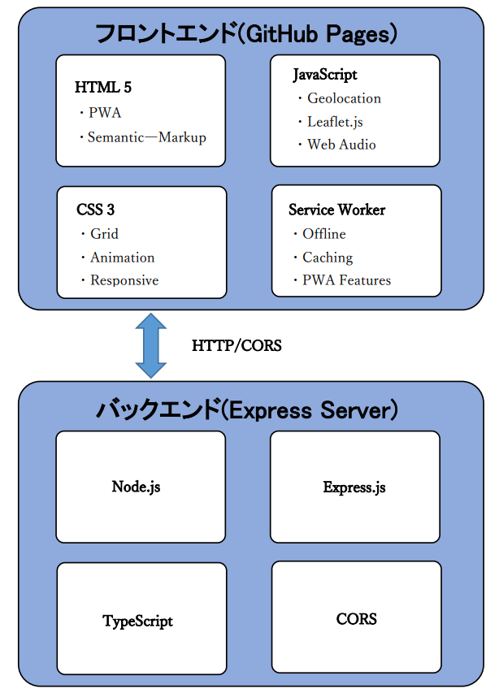
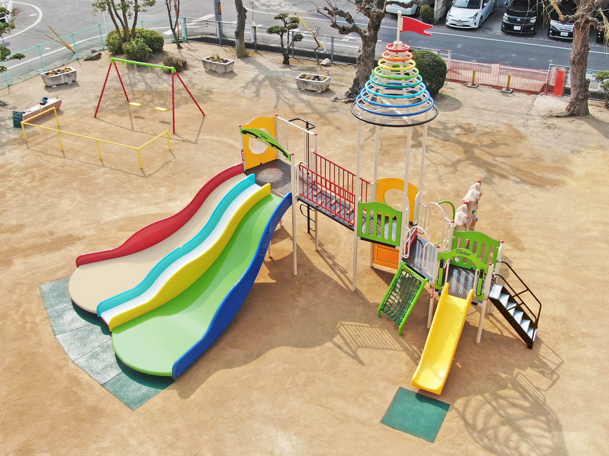

# 岡山GPSスタンプラリー システム仕様書（完全版）

## 📋 目次
1. [プロジェクト概要](#-プロジェクト概要)
2. [デモ・動作確認](#-デモ動作確認)
3. [0からの環境構築手順](#-0からの環境構築手順)
4. [機能詳細仕様](#-機能詳細仕様)
5. [技術仕様](#-技術仕様)
6. [開発手順（段階的実装）](#-開発手順段階的実装)
7. [テスト・デバッグ](#-テストデバッグ)
8. [運用・保守](#-運用保守)
9. [トラブルシューティング](#-トラブルシューティング)
10. [拡張・カスタマイズ](#-拡張カスタマイズ)

---

## 📋 プロジェクト概要

### 1.1 システム概要
本アプリは、岡山を舞台にした革新的なデジタルスタンプラリーゲームです。スマートフォンのGPS機能と連携し、プレイヤーは物理的な場所を巡ることで、バーチャルなスタンプをコレクションします。このプロジェクトは、単にゲームとして楽しむだけでなく、岡山の豊かな歴史、文化、そして日常の風景を再発見する旅を提供することを目的としています。地域に根ざしたスタンプラリー地点の選定は、プレイヤーに深い没入感と、地域との精神的な繋がりを感じさせることを目指して設計されています。

**開発期間**: 2週間インターンシップ  
**開発形態**: フロントエンド → バックエンド追加の段階的開発

### 1.2 システムの特徴
- 📍 **GPS連動**: 実際の観光地に行かないとスタンプが取れない
- 🗺️ **リアルタイム地図**: 現在地と目的地を視覚的に確認
- 🌍 **多言語対応**: 日本語・英語・韓国語・中国語
- 📱 **PWA対応**: スマホアプリのようにインストール可能
- 🎨 **図鑑機能**: ポケモン図鑑風のコレクション表示

### 遊び方とロケーション

本ゲームの遊び方は非常にシンプルです。プレイヤーはスマートフォンのGPS機能を有効にした状態で、指定されたスタンプラリー地点を訪れるだけです。各地点の特定のエリアに到達すると、自動的にスタンプが獲得され、それを知らせる効果音が再生されます。全てのスタンプを制覇すると、特別なクリアサウンドと共にゲームクリアとなります。

本スタンプラリーの旅は、岡山の歴史と自然、そして地域の日常が交差する4つの魅力的な地点を巡ります。

### スタンプラリー地点一覧

| 地点名 | 関連画像ファイル | 主要な特徴 | 歴史・文化的背景 |
| :--- | :--- | :--- | :--- |
| 西古松南部公園 | `location-0.jpg` | 昭和の面影を残す遊具、広大なグラウンド | 地域住民の憩いの場、ボール遊びに最適 |
| 大元公園 | `location-1.png` | 季節ごとのイベント、広場、ユニークな遊具 | 地域密着型のコミュニティ形成の場 |
| 岡山城 | `location-2.jpg` | 別名「烏城」、黒い外観、復元天守、現存櫓 | 宇喜多氏から池田氏の統治、廃城令後の変遷 |
| 岡山後楽園 | `location-3.jpg` | 日本三名園、回遊式庭園、岡山城を借景 | 池田綱政による築庭、藩主の静養の場 |
---

## 🎬 デモ・動作確認

### 2.1 ライブデモ
**🔗 デモサイト**: https://nuu1729.github.io/Okayama_GPS_RALLY/

### 2.2 動作画面

#### メイン画面


#### スタンプ獲得時
```
[📸 ここにスタンプ獲得アニメーションのGIFを掲載]
- 獲得成功メッセージ
- カードの見た目変化
- 効果音の再生タイミング
```

#### コレクション画面
獲得前：


獲得後：


#### 多言語・ダークモード
<video src="[docs/lang&theme_change.mp4](https://github.com/nuu1729/Okayama_GPS_RALLY/blob/main/docs/lang%26theme_change.mp4)" controls>
    <p>動画を再生するには、ブラウザを更新してください。</p>
</video>

### 2.3 動作デモ動画（スマホでのテスト画面）
```
[🎥 ここに実際の使用フローを示すデモ動画を掲載]
1. アプリ起動 → 位置情報許可
2. 地図で現在地確認
3. 目的地への移動（シミュレーション）
4. スタンプ獲得の瞬間
5. 全制覇時の花火アニメーション
```

---

## 🚀 0からの環境構築手順

### 3.1 必要なソフトウェアのインストール

#### Step 1: Node.jsのインストール
```bash
# 1. Node.js公式サイトからダウンロード
# https://nodejs.org/ → LTS版を選択

# 2. インストール確認
node --version  # v16以上であることを確認
npm --version   # npmも同時にインストールされる
```

#### Step 2: テキストエディタの準備
推奨エディタ:
- **Visual Studio Code** (無料、拡張機能豊富)
- **WebStorm** (有料、高機能)

VS Code推奨拡張機能:
```
- Live Server (HTMLのリアルタイムプレビュー)
- TypeScript and JavaScript Language Features
- HTML CSS Support
- Auto Rename Tag
```

#### Step 3: ブラウザの準備
開発用ブラウザ:
```
✅ Chrome (開発者ツールが優秀)
✅ Firefox (デバッグ機能充実)
⚠️ Safari (Mac環境でのテスト用)
```

### 3.2 プロジェクトのセットアップ

#### Step 1: リポジトリの取得
```bash
# GitHubからクローン
git clone https://github.com/nuu1729/Okayama_GPS_RALLY.git

# プロジェクトフォルダに移動
cd Okayama_GPS_RALLY

# フォルダ構成の確認
ls -la
# backend/  docs/  README.md  package.json が表示される
```

#### Step 2: バックエンドのセットアップ
```bash
# バックエンドフォルダに移動
cd backend

# 依存関係をインストール
npm install

# TypeScriptのcorsの型定義をインストール（重要！）
npm install --save-dev @types/cors

# 開発サーバーを起動
npm run dev

# ✅ 成功時の表示:
# ✅ Backend running at http://localhost:3000
# 🚀 正しい server.ts が起動しました！
```

#### Step 3: フロントエンドのセットアップ
```bash
# 新しいターミナルを開く
cd Okayama_GPS_RALLY/docs

# 方法1: Pythonを使う場合
python -m http.server 8080

# 方法2: Node.jsを使う場合  
npx http-server . -p 8080

# 方法3: VS Code Live Serverを使う場合
# index.htmlを右クリック → "Open with Live Server"
```

#### Step 4: 動作確認
```bash
# ブラウザで以下にアクセス
http://localhost:8080

# ✅ 正常動作の確認項目:
1. アプリタイトルが表示される
2. 位置情報の許可を求められる
3. 4つの観光地カードが表示される
4. 地図が正常に描画される
5. BGMコントロールが機能する
```

### 3.3 初回起動時のトラブルシューティング

#### 問題1: 位置情報が取得できない
```
解決策:
1. ブラウザで位置情報を「許可」する
2. HTTPS環境でない場合はlocalhostでテスト
3. デバッグボタンで座標を手動確認
```

#### 問題2: 地図が表示されない
```
解決策:
1. インターネット接続を確認
2. ブラウザのコンソールエラーをチェック
3. Leaflet.jsのCDNが正常に読み込まれているか確認
```

#### 問題3: バックエンドAPIに接続できない
```
解決策:
1. バックエンドサーバーが起動しているか確認
2. CORS設定を確認
3. フォールバックデータで動作確認
```

---

## 🎯 機能詳細仕様

### 4.1 コア機能一覧

| 機能名 | 説明 | 実装状況 | 優先度 |
|-------|------|---------|-------|
| GPS位置検出 | 現在地を取得し、目的地との距離を計算 | ✅ 完成 | 高 |
| スタンプ獲得判定 | 指定範囲内でのスタンプ獲得処理 | ✅ 完成 | 高 |
| リアルタイム地図 | Leafletによるインタラクティブ地図 | ✅ 完成 | 高 |
| 多言語切り替え | 日英韓中の4言語対応 | ✅ 完成 | 中 |
| コレクション表示 | 図鑑風のスタンプ管理 | ✅ 完成 | 中 |
| PWA機能 | オフライン対応・ホーム画面追加 | ✅ 完成 | 中 |
| BGM・効果音 | 雰囲気作りのオーディオ機能 | ✅ 完成 | 低 |
| ダークモード | 夜間利用時の快適性向上 | ✅ 完成 | 低 |

### 4.2 詳細機能仕様

#### 📍 GPS機能
```javascript
// 位置取得の仕様
位置精度: enableHighAccuracy: true
タイムアウト: 10秒
最大キャッシュ時間: 30秒
更新頻度: リアルタイム監視

// 距離計算
アルゴリズム: Haversine formula（球面三角法）
精度: メートル単位
判定範囲: 各スポット個別設定（100m〜200m）
```

#### 🗺️ 地図機能
```javascript
// Leaflet.js設定
地図プロバイダ: OpenStreetMap
初期表示: 岡山駅周辺 (34.6653, 133.9171)
ズームレベル: 13
マーカー: 各観光地 + 現在地（赤マーカー）
```

#### 🎨 UI/UX仕様
```css
/* レスポンシブブレークポイント */
デスクトップ: 1100px以上
タブレット: 768px〜1099px  
モバイル: 320px〜767px

/* カラーパレット */
プライマリ: #ff8c00 (オレンジ)
セカンダリ: #dc143c (赤)
アクセント: #daa520 (ゴールド)
背景: グラデーション + 背景画像
```

---

## 🏗️ 技術仕様

### 5.1 システム構成図




### 5.2 ファイル構成（詳細）
```
Okayama_GPS_RALLY/
├── 📁 backend/                    # バックエンドAPI
│   ├── 📁 src/
│   │   └── 📄 server.ts          # Express.js + スタンプデータ
│   ├── 📄 package.json           # 依存関係定義
│   ├── 📄 tsconfig.json          # TypeScript設定
│   └── 📁 dist/                  # ビルド成果物
│
├── 📁 docs/                       # フロントエンド（GitHub Pages用）
│   ├── 📄 index.html             # メインHTML（PWA Manifest込み）
│   ├── 📄 script.js              # 2500行のメインロジック
│   ├── 📄 style.css              # レスポンシブCSS + ダークモード
│   ├── 📄 sw.js                  # Service Worker（オフライン機能）
│   ├── 📄 manifest.json          # PWA設定ファイル
│   │
│   ├── 📁 images/                # 画像リソース
│   │   ├── 🖼️ background.jpg     # メイン背景画像
│   │   ├── 🖼️ location-0.jpg     # 西古松南部公園
│   │   ├── 🖼️ location-1.png     # 大元東公園  
│   │   ├── 🖼️ location-2.jpg     # 岡山城
│   │   ├── 🖼️ location-3.jpg     # 岡山後楽園
│   │   └── 🖼️ システム構成図.png   # システム構成
│   │
│   ├── 📁 icons/                 # PWA用アイコン
│   │   ├── 🎯 icon-192.png       # 192x192 アイコン
│   │   └── 🎯 icon-512.png       # 512x512 アイコン
│   │
│   └── 📁 Sounds/                # オーディオファイル
│       ├── 🎵 BGM.mp3            # バックグラウンドミュージック
│       ├── 🔊 one_getting.mp3    # スタンプ獲得音
│       ├── 🔊 missing_location.mp3 # エラー音
│       └── 🔊 gameclear.mp3      # 全制覇音
│
└── 📄 README.md                   # プロジェクト説明（詳細）
```

### 5.3 API仕様書

#### エンドポイント: `GET /api/stamps`
```typescript
// リクエスト
GET http://localhost:3000/api/stamps

// レスポンス
[
  {
    "id": 0,
    "name": {
      "ja": "西古松南部公園",
      "en": "Nishikomatsu Nanbu Park", 
      "ko": "니시코마츠 남부공원",
      "zh": "西古松南部公园"
    },
    "address": "〒700-0973 岡山県岡山市北区下中野",
    "lat": 34.6433,
    "lng": 133.9053,
    "radius": 100,
    "image": "images/location-0.jpg",
    "icon": "🌳"
  },
  // ... 他3件のデータ
]

// エラーハンドリング
- ネットワークエラー: フォールバックデータを使用
- CORS エラー: バックエンド設定確認
- タイムアウト: リトライ処理
```

---

## 🛠️ 開発手順（段階的実装）

### 6.1 Phase 1: 基本フロントエンド（1週目前半）

#### Step 1: HTML構造の作成
```html
<!-- 必須要素の実装順序 -->
1. ヘッダー（タイトル・進捗表示）
2. 言語選択・テーマ選択
3. ナビゲーションタブ
4. 4つの観光地カード
5. 地図コンテナ  
6. コレクション画面
7. フッター
8. デバッグコントロール
```

#### Step 2: CSS基本スタイル
```css
/* 実装順序 */
1. リセットCSS + 基本レイアウト
2. カラーパレット定義
3. グリッドレイアウト（観光地カード）  
4. レスポンシブ対応
5. アニメーション効果
6. ダークモード切り替え
```

#### Step 3: 基本JavaScript機能
```javascript
// 実装順序
1. DOM要素の取得・イベントリスナー設定
2. 静的データ定義（観光地情報）
3. 言語切り替え機能
4. タブ切り替え機能
5. ローカルストレージ管理
```

### 6.2 Phase 2: GPS・地図機能（1週目後半）

#### Step 4: 位置情報機能
```javascript
// 実装手順
1. Geolocation API の基本実装
   - navigator.geolocation.watchPosition
   - 権限取得・エラーハンドリング

2. 距離計算アルゴリズム
   - Haversine formula 実装
   - リアルタイム距離更新

3. スタンプ獲得判定
   - 範囲内判定ロジック
   - ボタンの有効/無効切り替え
```

#### Step 5: 地図統合
```javascript  
// Leaflet.js 実装手順
1. CDNの読み込み確認
2. 基本地図の表示
3. 観光地マーカーの配置
4. 現在地マーカー（赤色）の表示
5. 地図とGPSデータの同期
```

### 6.3 Phase 3: 高度な機能（2週目前半）

#### Step 6: PWA機能の実装
```javascript
// Service Worker実装
1. sw.js ファイル作成
2. キャッシュ戦略の定義
3. オフライン対応
4. manifest.json設定
5. インストール可能性の確認
```

#### Step 7: オーディオ・アニメーション
```javascript
// エンターテイメント機能
1. BGMコントロール実装
2. 効果音の再生タイミング調整
3. スタンプ獲得時アニメーション
4. 全制覇時の花火エフェクト
5. Web Audio API フォールバック
```

### 6.4 Phase 4: バックエンド追加（2週目後半）

#### Step 8: Express.js サーバー構築
```typescript
// backend/src/server.ts 実装
1. 基本的なExpressサーバー設定
2. CORS設定（重要！）
3. スタンプデータのJSON化
4. /api/stamps エンドポイント作成
5. TypeScript設定・ビルド確認
```

#### Step 9: フロント・バック連携
```javascript
// script.js の更新
1. fetch API でバックエンド呼び出し
2. エラーハンドリング・フォールバック
3. 非同期処理の調整
4. ローディング状態の表示
```

### 6.5 Phase 5: 最終調整・テスト

#### Step 10: 品質向上
```
1. クロスブラウザテスト
2. レスポンシブデザイン調整  
3. アクセシビリティ改善
4. パフォーマンス最適化
5. デバッグ機能の充実
```

---

## 🧪 テスト・デバッグ

### 7.1 機能テストチェックリスト

#### 基本機能テスト
```
✅ GPS機能
□ 位置情報の許可要求が表示される
□ 現在地が正確に取得される
□ 各観光地までの距離が正しく計算される
□ 距離がリアルタイムで更新される

✅ スタンプ獲得
□ 範囲外では「あと○m近づいて」と表示
□ 範囲内で「スタンプを獲得する」ボタンが有効化
□ 獲得成功時にメッセージと効果音
□ 重複獲得を防止

✅ 地図機能
□ 地図が正常に描画される
□ 4つの観光地マーカーが正確な位置に表示
□ 現在地マーカー（赤）が表示・更新される
□ ズーム・パン操作が可能

✅ UI/UX
□ 4言語で表示が正しく切り替わる
□ ダークモード切り替えが機能
□ タブ切り替えが正常動作
□ レスポンシブデザインが各デバイスで機能
```

#### コレクション機能テスト
```
✅ 表示テスト
□ 未獲得スタンプは「???」で隠される
□ 獲得後は写真と詳細情報が表示される
□ 言語切り替えが反映される

✅ データ永続化
□ ブラウザを閉じても獲得状態が保持される
□ 言語設定が保存される
□ テーマ設定が保存される
```

### 7.2 デバッグ機能の使い方

#### デバッグモードの活用
```javascript
// デバッグボタンの使用方法

1. 🐞 デバッグモード切替
   → デバッグ専用ボタンを表示/非表示

2. 📍 現在地表示  
   → 現在の緯度・経度座標をアラートで確認
   → GPS精度の問題切り分けに使用

3. ✅ 全て獲得
   → テスト用に全スタンプを獲得済み状態に
   → コレクション画面の動作確認

4. 🗑️ 全てクリア
   → 全データを削除してリセット
   → 初回利用状態に戻す
```

#### ブラウザ開発者ツール活用
```javascript
// Chrome DevTools での確認項目

Console タブ:
- エラーメッセージの確認
- GPS座標の出力確認
- API通信状況の確認

Network タブ:
- バックエンドAPIの通信状況
- 画像・音声ファイルの読み込み
- CDN（Leaflet.js）の読み込み状況  

Application タブ:
- Local Storage の保存データ確認
- Service Worker の動作状況
- PWA Manifest の設定確認
```

### 7.3 よくあるトラブルと解決法

#### 🚨 位置情報が取得できない
```
症状: 「位置情報を読み込み中」から進まない

原因と解決策:
1. 権限が拒否されている
   → ブラウザのアドレスバー左の鍵アイコンから許可

2. HTTPS環境でない  
   → localhost または HTTPS サイトで動作確認

3. GPS機能がオフ
   → 端末の位置情報設定を確認

4. 屋内・地下での精度低下
   → 屋外でのテスト推奨
```

#### 🚨 地図が表示されない
```
症状: 地図エリアが灰色のまま

原因と解決策:
1. Leaflet.js CDNが読み込めない
   → ネットワーク接続確認
   → CDN URL の変更検討

2. 地図コンテナのサイズが0
   → CSS の height 設定確認

3. 初期化タイミングの問題
   → DOMContentLoaded 後の実行確認
```

#### 🚨 バックエンドに接続できない
```
症状: スタンプデータが表示されない

原因と解決策:
1. サーバーが起動していない
   → npm run dev の実行確認

2. ポート番号の競合
   → 3000番ポートの使用状況確認

3. CORS設定の問題
   → corsミドルウェアの設定確認

4. TypeScript エラー
   → @types/cors のインストール確認
```

---

## 🔧 運用・保守

### 8.1 デプロイメント手順

#### GitHub Pages へのデプロイ
```bash
# 1. GitHubリポジトリにプッシュ
git add .
git commit -m "Update stamp rally app"  
git push origin main

# 2. GitHub Pagesの設定
# GitHub リポジトリページ → Settings → Pages
# Source: Deploy from a branch
# Branch: main / docs (docsフォルダを指定)

# 3. 公開URL の確認  
# https://username.github.io/repository-name/
```

#### バックエンドのデプロイ（本番環境）
```bash
# 推奨サービス
1. Heroku (無料プランあり)
2. Railway (モダンな選択肢)  
3. Vercel (サーバーレス)
4. AWS/GCP (スケーラブル)

# 環境変数の設定
PORT=3000
NODE_ENV=production
CORS_ORIGIN=https://your-domain.github.io
```

### 8.2 監視・メンテナンス項目

#### 定期確認項目（月1回）
```
✅ システム稼働状況
□ フロントエンドサイトのアクセス確認
□ バックエンドAPIの応答確認  
□ HTTPS証明書の期限確認

✅ データ・コンテンツ更新
□ 観光地情報の最新化
□ 住所・連絡先の確認
□ 画像の差し替え検討

✅ 技術的更新
□ 依存関係の脆弱性スキャン
□ ブラウザサポート状況確認
□ CDNの稼働状況確認
```

#### パフォーマンス監視
```javascript
// 監視指標
1. 位置情報取得時間: < 10秒
2. 地図描画時間: < 3秒
3. ページ読み込み時間: < 5秒  
4. PWA キャッシュヒット率: > 80%

// ツール
- Google PageSpeed Insights
- Lighthouse (PWA 評価)
- Browser Developer Tools
```

### 8.3 バックアップ・復旧

#### データバックアップ
```bash
# ソースコードのバックアップ
git clone --mirror https://github.com/username/repo.git

# 画像・音声ファイルの別途保管
cp -r docs/images/ backup/images/
cp -r docs/Sounds/ backup/Sounds/
```

#### 障害時の復旧手順
```
1. 症状の特定
   - フロントエンドのみの問題か
   - バックエンドAPIの問題か  
   - 外部サービス（地図・CDN）の問題か

2. 緊急対応
   - フォールバックモードでの稼働確認
   - 静的データでの一時運用

3. 根本対応  
   - 原因調査と修正
   - テスト環境での動作確認
   - 段階的な本番反映
```

---

## 🎯 拡張・カスタマイズ

### 9.1 新しい観光地の追加手順

#### Step 1: バックエンドデータの追加
```typescript
// backend/src/server.ts を編集
const stamps = [
    // 既存の4つのスタンプ...
    
    // 新しいスタンプを追加
    { 
        id: 4,  // 連番で設定
        name: {
            ja: "新観光地名", 
            en: "New Tourist Spot",
            ko: "새로운 관광지",
            zh: "新旅游景点"
        },
        address: "〒700-xxxx 岡山県岡山市○○区○○",
        lat: 34.6XXX,     // 緯度（Google Mapsで確認）
        lng: 133.9XXX,    // 経度（Google Mapsで確認）
        radius: 150,      // 判定範囲（メートル）
        image: "images/location-4.jpg",  // 画像パス
        icon: "🏛️"        // 絵文字アイコン
    }
];
```

#### Step 2: 画像の準備
```bash
# 新しい観光地の画像を追加
docs/images/location-4.jpg

# 推奨画像仕様:
解像度: 800x600px 以上
形式: JPEG または PNG  
容量: 500KB 以下（読み込み速度考慮）
内容: 観光地の代表的な写真
```

#### Step 3: フロントエンドの調整
```javascript
// script.js では自動的に新しいデータを処理するため、
// 基本的に変更不要

// ただし、カード表示の調整が必要な場合:
// updateLocationCards() 関数を確認

// 総スタンプ数の表示は自動更新される
```

#### Step 4: 動作確認
```bash
# バックエンド再起動
cd backend
npm run dev

# ブラウザで確認
1. 5つ目の観光地カードが表示される
2. 地図上に新しいマーカーが追加される  
3. 距離計算が正常に動作する
4. スタンプ獲得・コレクション表示が正常動作
```

### 9.2 デザインカスタマイズ

#### カラーテーマの変更
```css
/* style.css のカラー変数を編集 */

/* 現在のオレンジテーマ */
:root {
  --primary-color: #ff8c00;    /* メインオレンジ */
  --secondary-color: #dc143c;   /* アクセント赤 */
  --accent-color: #daa520;      /* ゴールド */
}

/* 例: ブルーテーマに変更 */
:root {
  --primary-color: #1e90ff;    /* ディープスカイブルー */
  --secondary-color: #4169e1;   /* ロイヤルブルー */
  --accent-color: #00ced1;      /* ダークターコイズ */
}

/* 例: グリーンテーマに変更 */
:root {
  --primary-color: #32cd32;    /* ライムグリーン */
  --secondary-color: #228b22;   /* フォレストグリーン */
  --accent-color: #3cb371;      /* ミディアムシーグリーン */
}
```

#### 背景画像の変更
```css
/* body::before セクションを編集 */
body::before {
  background:
    url('images/your-new-background.jpg') center/cover no-repeat,
    /* 既存のグラデーション設定... */
}

/* 推奨背景画像仕様 */
解像度: 1920x1080px 以上
形式: JPEG  
容量: 1MB 以下
内容: 岡山らしい風景（城、桜、後楽園など）
```

#### フォント・タイポグラフィの調整
```css
/* フォントファミリーの変更 */
body {
  font-family: "游ゴシック", "Yu Gothic", "Noto Sans JP", sans-serif;
}

/* タイトルフォントのサイズ調整 */
.header h1 { 
  font-size: clamp(1.6rem, 3.2vw, 2.2rem);  /* より大きく */
}

/* カード内テキストの調整 */
.location-name {
  font-size: 1.1rem;  /* 少し大きく */
  font-weight: 800;    /* より太く */
}
```

### 9.3 機能拡張アイデア

#### 高優先度拡張機能

##### 1. ユーザー認証システム
```typescript
// 実装構想
interface User {
  id: string;
  username: string;
  email: string;
  collectedStamps: number[];
  createdAt: Date;
}

// 必要な実装:
- Firebase Auth または Auth0 連携
- ユーザー固有のスタンプ進捗保存
- ランキング機能
- SNS連携（Twitter/Instagram シェア）
```

##### 2. 写真投稿機能
```javascript
// カメラAPI活用
navigator.mediaDevices.getUserMedia({ video: true })

// 実装内容:
- スタンプ獲得時に記念写真撮影
- 位置情報付き写真の保存
- 他ユーザーの写真閲覧
- 写真品質でのボーナスポイント
```

##### 3. リアルタイム通知
```javascript
// Push API 活用
// Service Worker で実装

// 通知タイミング:
- 観光地に近づいた時（500m圏内）
- 友達が近くにいる時
- 新しい観光地が追加された時
- イベント・キャンペーン情報
```

#### 中優先度拡張機能

##### 4. ゲーミフィケーション要素
```typescript
interface Achievement {
  id: string;
  title: string;
  description: string;
  condition: string;
  reward: number;
}

// 実装例:
const achievements = [
  {
    id: "first_stamp",
    title: "はじめの一歩",
    description: "初めてのスタンプを獲得",
    reward: 100
  },
  {
    id: "speed_collector",
    title: "スピードコレクター", 
    description: "1日で全スタンプ獲得",
    reward: 500
  }
];
```

##### 5. AR（拡張現実）機能
```javascript
// WebXR Device API 活用
navigator.xr.requestSession('immersive-ar')

// 実装内容:
- 観光地でのAR案内表示
- 3Dキャラクターによるガイド
- 歴史的建造物の復元表示
- ARフォトフレーム機能
```

##### 6. 多地域対応
```typescript
// 新しい地域データの追加
interface Region {
  id: string;
  name: LocalizedString;
  center: { lat: number; lng: number };
  stamps: Stamp[];
}

const regions = [
  { id: "okayama", name: {...}, center: {...}, stamps: [...] },
  { id: "hiroshima", name: {...}, center: {...}, stamps: [...] },
  { id: "kagawa", name: {...}, center: {...}, stamps: [...] }
];
```

### 9.4 技術的改善項目

#### パフォーマンス最適化
```javascript
// 1. 画像の遅延読み込み


// 2. Service Worker キャッシュ戦略改善
const CACHE_STRATEGY = {
  images: 'cache-first',      // 画像は積極的キャッシュ
  api: 'network-first',       // APIは最新データ優先
  static: 'stale-while-revalidate'  // 静的ファイルは背景更新
};

// 3. 位置情報取得の最適化
const geoOptions = {
  enableHighAccuracy: false,   // バッテリー節約モード追加
  timeout: 15000,             // タイムアウト延長
  maximumAge: 60000           // キャッシュ時間延長
};
```

#### セキュリティ強化
```typescript
// 1. API レート制限
import rateLimit from "express-rate-limit";

const limiter = rateLimit({
  windowMs: 15 * 60 * 1000,  // 15分
  max: 100                   // 最大100リクエスト
});

// 2. 入力値検証
import { body, validationResult } from 'express-validator';

// 3. HTTPS 強制
app.use((req, res, next) => {
  if (req.header('x-forwarded-proto') !== 'https') {
    res.redirect(`https://${req.header('host')}${req.url}`);
  } else {
    next();
  }
});
```

#### データベース導入
```typescript
// MongoDB with Mongoose
interface StampDocument {
  _id: ObjectId;
  name: LocalizedString;
  location: {
    type: 'Point',
    coordinates: [number, number]  // [longitude, latitude]
  };
  radius: number;
  isActive: boolean;
  createdAt: Date;
  updatedAt: Date;
}

// クエリ例（位置情報による検索）
const nearbyStamps = await Stamp.find({
  location: {
    $near: {
      $geometry: { type: "Point", coordinates: [lng, lat] },
      $maxDistance: 1000  // 1km以内
    }
  }
});
```

### 9.5 国際化（i18n）の拡張

#### 新言語の追加手順
```javascript
// 1. translations オブジェクトに追加
const translations = {
  // 既存言語...
  
  // フランス語追加
  fr: {
    appTitle: "🏯 Rallye de Timbres GPS d'Okayama",
    stampLabel: "Timbres collectés",
    calculating: "Calcul de la distance...",
    getStamp: "Obtenir le timbre!",
    // ... 全テキストを翻訳
  },
  
  // スペイン語追加  
  es: {
    appTitle: "🏯 Rally de Sellos GPS de Okayama",
    stampLabel: "Sellos recolectados",
    calculating: "Calculando distancia...",
    getStamp: "¡Obtener sello!",
    // ... 全テキストを翻訳
  }
};

// 2. 言語選択UIに追加
<select id="languageSelect">
  <!-- 既存オプション... -->
  <option value="fr">🇫🇷 Français</option>
  <option value="es">🇪🇸 Español</option>
</select>

// 3. 日付・数値フォーマット対応
const formatDistance = (distance, locale) => {
  return new Intl.NumberFormat(locale, {
    style: 'unit',
    unit: 'meter',
    unitDisplay: 'short'
  }).format(distance);
};
```

#### 右から左（RTL）言語サポート
```css
/* アラビア語・ヘブライ語対応 */
[dir="rtl"] .location-header {
  direction: rtl;
  text-align: right;
}

[dir="rtl"] .location-info {
  margin-left: 0;
  margin-right: 14px;
}

[dir="rtl"] .controls {
  flex-direction: row-reverse;
}
```

---

## 📊 運用統計・分析

### 10.1 Google Analytics 実装
```html
<!-- index.html に追加 -->
<script async src="https://www.googletagmanager.com/gtag/js?id=GA_MEASUREMENT_ID"></script>
<script>
  window.dataLayer = window.dataLayer || [];
  function gtag(){dataLayer.push(arguments);}
  gtag('js', new Date());
  gtag('config', 'GA_MEASUREMENT_ID');
  
  // カスタムイベント
  function trackStampCollection(stampId) {
    gtag('event', 'stamp_collected', {
      'stamp_id': stampId,
      'location': locations[stampId].name.ja
    });
  }
</script>
```

### 10.2 ユーザー行動分析
```javascript
// 収集すべき指標
const analytics = {
  // 基本指標
  totalUsers: 0,
  sessionsPerUser: 0,
  averageSessionDuration: 0,
  
  // スタンプ関連
  stampCollectionRate: {
    location0: 0.85,  // 西古松南部公園: 85%
    location1: 0.78,  // 大元東公園: 78%  
    location2: 0.92,  // 岡山城: 92%
    location3: 0.88   // 岡山後楽園: 88%
  },
  
  completionRate: 0.65,  // 全制覇率: 65%
  
  // 技術指標
  gpsAccuracy: {
    high: 0.70,    // <50m: 70%
    medium: 0.25,  // 50-100m: 25%
    low: 0.05      // >100m: 5%
  },
  
  browserSupport: {
    chrome: 0.60,
    safari: 0.25,
    firefox: 0.10,
    edge: 0.05
  }
};
```

---

## 🚨 トラブルシューティング完全版

### 11.1 環境構築時のエラー

#### Node.js関連
```bash
# Error: "npm: command not found"
解決策:
1. Node.js公式サイトから再インストール
2. PATH環境変数の確認
3. ターミナル/コマンドプロンプトの再起動

# Error: "EACCES: permission denied"  
解決策:
sudo npm install -g npm  # macOS/Linux
# または
npm config set prefix ~/.npm-global  # 権限回避
```

#### TypeScript関連
```bash
# Error: "Cannot find module 'cors'"
解決策:
npm install --save-dev @types/cors

# Error: "Compilation error in server.ts"
解決策:
1. tsconfig.json の設定確認
2. TypeScript バージョン確認
3. npm run build でビルドテスト
```

### 11.2 実行時エラー

#### GPS・位置情報エラー
```javascript
// Error: "Geolocation API is not supported"
if (!navigator.geolocation) {
  // フォールバック処理
  showStatus("お使いのブラウザは位置情報に対応していません", 'error');
  // 手動位置入力UIを表示
}

// Error: "User denied Geolocation"  
navigator.geolocation.getCurrentPosition(
  success,
  (error) => {
    if (error.code === error.PERMISSION_DENIED) {
      showLocationPermissionHelp();  // 許可方法の案内表示
    }
  }
);
```

#### 地図表示エラー  
```javascript
// Error: "Map container is being reused"
// 解決策: 既存のマップインスタンスを削除
if (map) {
  map.remove();
  map = null;
}
map = L.map('map').setView([34.6653, 133.9171], 13);

// Error: "Leaflet CSS not loaded"
// 解決策: CDN読み込み確認
const checkLeafletCSS = () => {
  const link = document.createElement('link');
  link.rel = 'stylesheet';
  link.href = 'https://unpkg.com/leaflet/dist/leaflet.css';
  document.head.appendChild(link);
};
```

#### PWA関連エラー
```javascript
// Error: "Service worker registration failed"
if ('serviceWorker' in navigator) {
  navigator.serviceWorker.register('./sw.js')
    .catch(err => {
      console.error('SW registration failed:', err);
      // フォールバック: 通常のWebアプリとして動作
    });
}

// Error: "Add to homescreen not working"
// 解決策: PWA要件チェック
const checkPWARequirements = () => {
  // 1. HTTPS確認
  // 2. manifest.json の妥当性確認  
  // 3. Service Worker の動作確認
  // 4. アイコン画像の存在確認
};
```

### 11.3 パフォーマンス問題

#### 遅延・重い動作
```javascript
// 問題: GPS更新が頻繁すぎる
const throttledUpdateDistances = throttle(updateDistances, 2000);  // 2秒間隔

// 問題: 地図描画が重い
const mapOptions = {
  zoomControl: false,        // 不要なコントロール削除
  attributionControl: false, // 表示軽量化
  preferCanvas: true         // Canvas描画で高速化
};

// 問題: 画像読み込みが遅い
const optimizeImages = () => {
  // WebP対応確認
  const supportsWebP = document.createElement('canvas')
    .toDataURL('image/webp').indexOf('webp') > -1;
    
  return supportsWebP ? 'images/location-0.webp' : 'images/location-0.jpg';
};
```

---

## 📚 学習リソース・参考資料

### 12.1 技術学習リソース

#### JavaScript・Web API
```
📖 必読資料:
- MDN Web Docs: Geolocation API
  https://developer.mozilla.org/ja/docs/Web/API/Geolocation_API

- Service Worker 入門
  https://developers.google.com/web/fundamentals/primers/service-workers

- PWA ガイドライン
  https://web.dev/progressive-web-apps/

📺 動画学習:
- JavaScript ES6+ 完全ガイド
- PWA開発チュートリアル  
- Leaflet.js 地図アプリ開発
```

#### Node.js・Express
```  
📖 公式ドキュメント:
- Express.js ガイド
  https://expressjs.com/ja/guide/

- Node.js 公式チュートリアル
  https://nodejs.org/ja/docs/guides/

📚 推奨書籍:
- "Node.js実践入門" 
- "Express実践ガイド"
- "TypeScript実践プログラミング"
```

#### GPS・地理情報システム
```
🌍 専門知識:
- 測地系・座標系の基礎知識
- Haversine公式の数学的背景  
- GPS精度と誤差要因
- Web Mercator投影法

🛠️ 関連ツール:
- Google Maps Platform
- OpenStreetMap Overpass API
- QGIS（地理情報システム）
```

### 12.2 類似プロジェクト・参考事例

#### 国内事例
```
🇯🇵 日本国内:
- 東京スタンプラリー（JR東日本）
- 横浜ベイエリアGPSスタンプラリー  
- 京都デジタルスタンプラリー
- 沖縄観光ARアプリ

💡 学べるポイント:
- UI/UXデザインパターン
- ゲーミフィケーション手法
- 地域観光との連携方法
```

#### 海外事例
```
🌍 海外事例:
- Pokémon GO (位置情報ゲームの先駆け)
- Geocaching (世界最大のGPSゲーム)
- Ingress (拡張現実位置ゲーム)
- CityMapper (都市交通案内)

🔍 技術的参考点:
- 位置情報の効率的処理
- バッテリー消費最適化
- オフライン対応戦略
```

---

## 📋 まとめ・次のステップ

### 13 現在の到達レベル

#### ✅ 完成済み機能
- GPS連動スタンプ収集システム
- リアルタイム地図表示
- 多言語対応（4言語）
- PWA機能（オフライン動作）  
- コレクション機能（図鑑風）
- ダークモード対応
- バックエンドAPI連携

#### 🎯 システムの成熟度
```
レベル: ★★★★☆ (プロトタイプ完成レベル)

強み:
✅ 基本機能は全て動作
✅ モダンな技術スタック
✅ レスポンシブ対応完了
✅ 実用的な観光促進効果

改善の余地:
⚠️ ユーザー管理機能なし
⚠️ データベース未導入
⚠️ 本格的なテスト未実施
⚠️ セキュリティ対策が基本レベル
```

**📝 仕様書バージョン**: v1.0  
**最終更新**: 2025年9月  
**作成者**: nuu1729  
**プロジェクト**: 岡山GPSスタンプラリー
