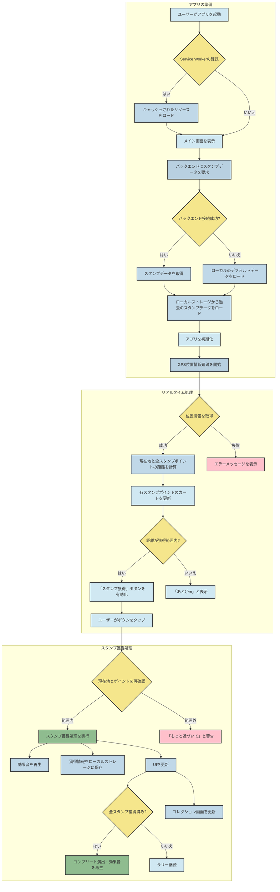

## 岡山GPSスタンプラリー 企画設計書(簡易版)

### 1. プロジェクト概要

本プロジェクトは、観光客や地元住民が岡山の歴史的な名所や自然を楽しみながら巡る**GPSスタンプラリーアプリケーション**の開発を目的とします。スマートフォン（iOS/Android）のGPS機能を利用し、指定されたチェックポイントに近づくとデジタルスタンプを獲得できる仕組みを提供します。

### 2. アプリケーションの動作ビジョン

アプリの核となる機能は、「ユーザーの現在地」と「チェックポイントの位置」を照合し、距離が一定範囲内であればスタンプを獲得できることです。

### アプリケーション処理フロー（概要）

このGPSスタンプラリーアプリは、主に以下の3つの段階で動作します。

1.  **起動時: データの読み込みと初期化**

      * アプリを起動すると、まずバックエンドサーバーにアクセスして、スタンプポイントの情報を取得します。
      * 同時に、過去に獲得したスタンプの情報や、選択した言語設定をブラウザのローカルストレージから読み込みます。
      * これらの情報が揃うと、アプリの画面（地図やチェックポイント一覧）が正しく表示されるようになります。

2.  **実行時: ユーザーの位置追跡とスタンプ判定**

      * アプリは、スマートフォンのGPS機能を使って、ユーザーの現在地をリアルタイムで追跡し続けます。
      * 追跡した現在地と各スタンプポイントの距離を常に計算しています。
      * 画面上のチェックポイント一覧には、現在地からの距離がリアルタイムで更新・表示されます。
      * ユーザーがスタンプポイントに近づき、あらかじめ設定された距離（例: 半径100m以内）に入ると、ボタンが有効化され、スタンプを獲得できるようになります。

3.  **アクション時: スタンプ獲得とデータの保存**

      * 有効化されたボタンをユーザーがタップすると、アプリは再度、現在地とスタンプポイントの距離を最終確認します。
      * 距離が条件を満たしていれば、スタンプ獲得成功として画面が更新され、効果音やお祝いのアニメーションが流れます。
      * 獲得したスタンプの情報は、次回アプリを起動したときにも保持されるように、ローカルストレージに保存されます。
      * すべてのスタンプをコンプリートすると、特別なメッセージと演出でユーザーをお祝いします。

-----

### アプリケーション処理フロー（詳細フローチャート）

以下のフローチャートは、ユーザーの操作とアプリの内部処理をより具体的に示しています。

---

### 3. 主要機能と開発ビジョン

このアプリを開発するにあたり、以下の主要機能を実装する計画です。各機能は、ユーザー体験の向上と安定した動作を目標とします。

#### 3.1. バックエンドシステム

* **機能**: スタンプラリーのチェックポイントデータや、将来的なユーザーデータなどを一元管理するバックエンドシステムを構築します。
* **開発ビジョン**:
    * **データ提供**: `Express.js`フレームワークと`REST API`を使い、フロントエンドからのリクエストに応じてスタンプラリーの情報を効率的に提供します。
    * **データの拡張性**: 将来的にチェックポイントの追加や変更が容易に行えるよう、シンプルなJSON形式でデータを管理します。これにより、アプリの更新なしで新しいイベントに対応できるようになります。
    * **環境構築**: `Node.js`環境で`TypeScript`を使用し、開発効率とコードの堅牢性を高めます。

#### 3.2. メイン画面：ラリーマップとチェックポイント一覧

* **機能**: ユーザーは現在地から各チェックポイントまでの距離をリアルタイムで確認できます。スタンプ獲得の状況も一覧で表示されます。
* **開発ビジョン**:
    * **GPS追跡**: `Geolocation API`の`watchPosition`メソッドを利用して、ユーザーの位置を継続的に監視します。
    * **距離計算**: 緯度と経度から正確な距離を計算する**Haversine公式**の関数を実装します。
    * **UI/UX**: `JavaScript`で動的に各チェックポイントのカードを生成し、獲得状況や距離に応じてボタンの見た目を変更します。

#### 3.3. コレクション画面：獲得したスタンプの閲覧

* **機能**: ユーザーが獲得したスタンプが図鑑のように表示される画面です。スタンプ未獲得の場所は「???」と表示され、獲得後に場所の画像や詳細情報がアンロックされます。
* **開発ビジョン**:
    * **データ永続化**: スタンプの獲得状況をブラウザの`localStorage`に保存し、アプリを閉じてもデータが失われないようにします。
    * **動的UI**: 獲得状況に応じて画像の表示/非表示を切り替え、テキストを更新する処理を実装します。

#### 3.4. 多言語対応

* **機能**: 日本語、英語、韓国語、中国語の4言語に対応し、ユーザーは自由に言語を切り替えられます。
* **開発ビジョン**:
    * **翻訳データ管理**: 全ての翻訳テキストを`translations`という単一の`JavaScript`オブジェクトに集約し、言語切り替え時に一括でUIテキストを更新する関数を設計します。

#### 3.5. オフライン対応と安定性

* **機能**: インターネット接続がない環境でもアプリの基本的な動作（スタンプ獲得、コレクション閲覧）が可能です。
* **開発ビジョン**:
    * **Service Worker**: `Service Worker`を利用して、アプリの主要なHTML、CSS、JavaScript、および画像や音声ファイルをキャッシュします。これにより、ネットワークが不安定な場合でもスムーズな体験を提供します。

---

### 4. 技術スタック

* **フロントエンド**: HTML, CSS, JavaScript
* **バックエンド**: Node.js, Express.js, TypeScript
* **位置情報**: Geolocation API, Leaflet.js（地図表示用）
* **データ管理**: ローカルストレージ
* **オフライン機能**: Service Worker

---

### 5. 開発スケジュール（予定）

| 期間 | フェーズ | 予定している作業 |
| :--- | :--- | :--- |
| 第1週 | **企画・設計** | 顧客ヒアリング、要件定義、UI/UX設計、基本機能のプロトタイプ作成 |
| 第2週 | **開発・実装** | 主要機能の実装（GPS、スタンプ獲得、コレクション画面）、オフライン対応、多言語化 |
| 第3週 | **テスト・改善** | 動作テスト（各環境）、バグ修正、UI/UXの微調整、パフォーマンス改善 |
| 第4週 | **デプロイ・公開** | 最終レビュー、公開準備 |
