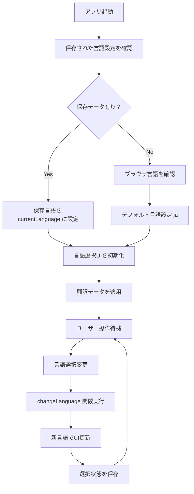

# GPS スタンプラリーアプリ システム設計書

## 📋 文書概要

**文書種別**: 詳細設計書  
**作成目的**: SE業務委託における機能実装仕様の明確化  
**対象読者**: システムエンジニア・プログラマー  
**前提知識**: JavaScript, HTML/CSS, REST API の基礎知識  

---

## 🎯 システム全体概要

### 1.1 委託要件概要
```
顧客要求:
「岡山県の観光地を巡るGPSスタンプラリーアプリを開発したい。
 実際に現地に行かないとスタンプが取れないシステムで、
 外国人観光客にも対応できるよう多言語機能が必要。
 スマホで気軽に使えるWebアプリにしてほしい。」

技術要件:
- GPS位置情報連動
- 多言語対応（日英韓中）
- スマートフォン最適化
- PWA対応（オフライン利用可能）
```

### 1.2 機能分解・優先度設定

| 機能ID | 機能名 | 詳細要件 | 優先度 | 工数見積 |
|--------|--------|----------|---------|----------|
| **F001** | GPS位置検出・距離計算 | 現在地取得、観光地との距離算出 | **高** | 3日 |
| **F002** | スタンプ獲得判定 | 指定範囲内での獲得処理 | **高** | 2日 |
| **F003** | 多言語切り替え機能 | 4言語対応・UI動的変更 | **高** | 2日 |
| **F004** | インタラクティブ地図表示 | 現在地・目的地可視化 | 中 | 2日 |
| **F005** | コレクション管理 | 獲得状況表示・永続化 | 中 | 2日 |
| **F006** | PWA機能 | オフライン動作・アプリ化 | 低 | 1日 |

**総工数見積**: 12日間（設計・テスト含む）

---

## 🔧 核心機能の詳細設計

## 機能F003: 多言語切り替え機能

### 2.1 機能仕様

#### 要件定義
```
顧客要求:
「日本語、英語、韓国語、中国語の4言語に対応し、
 ユーザーが選択した言語でアプリ全体が即座に切り替わること。
 選択した言語はブラウザを閉じても保持されること。」

受け入れ条件:
✅ 言語選択UIから4言語を選択可能
✅ 選択後、全UI要素が即座に切り替わる
✅ ブラウザ再起動後も選択状態を維持
✅ 観光地名・住所も対応言語で表示
```

#### 技術仕様
```typescript
// データ構造定義
interface TranslationData {
  [languageCode: string]: {
    [textKey: string]: string
  }
}

interface LocationName {
  ja: string
  en: string  
  ko: string
  zh: string
}

// 状態管理
let currentLanguage: string = 'ja'  // デフォルト日本語
const supportedLanguages = ['ja', 'en', 'ko', 'zh']
```

### 2.2 処理フロー設計

#### メイン処理フロー


### 2.3 関数設計仕様

#### 関数1: `initializeLanguageSystem()`
```typescript
/**
 * 言語システムの初期化
 * アプリ起動時に一度だけ実行される
 */
function initializeLanguageSystem(): void {
  // 1. 保存済み言語設定を確認
  const savedLanguage = getSavedLanguage()
  
  // 2. 有効な言語コードかチェック
  if (savedLanguage && supportedLanguages.includes(savedLanguage)) {
    currentLanguage = savedLanguage
  } else {
    // 3. ブラウザの言語設定を確認
    const browserLang = navigator.language.substring(0, 2)
    currentLanguage = supportedLanguages.includes(browserLang) ? browserLang : 'ja'
  }
  
  // 4. 言語選択UIに反映
  const languageSelect = document.getElementById('languageSelect') as HTMLSelectElement
  if (languageSelect) {
    languageSelect.value = currentLanguage
  }
  
  // 5. 初回翻訳適用
  applyTranslations()
}

/**
 * 呼び出しタイミング: DOMContentLoaded イベント時
 * 前提条件: HTML要素が全て読み込まれていること
 * 戻り値: なし
 */
```

#### 関数2: `changeLanguage(newLanguage: string)`
```typescript
/**
 * 言語切り替えメイン処理
 * ユーザーが言語を選択した際に実行
 */
function changeLanguage(newLanguage?: string): void {
  // 1. 引数チェック（UI要素からの取得も対応）
  if (!newLanguage) {
    const selectElement = document.getElementById('languageSelect') as HTMLSelectElement
    newLanguage = selectElement?.value || 'ja'
  }
  
  // 2. 有効な言語コードかバリデーション
  if (!supportedLanguages.includes(newLanguage)) {
    console.warn(`Unsupported language: ${newLanguage}`)
    return
  }
  
  // 3. 現在の言語と同じ場合はスキップ
  if (currentLanguage === newLanguage) {
    return
  }
  
  // 4. 言語切り替え実行
  currentLanguage = newLanguage
  
  // 5. 全UI要素を新言語で更新
  applyTranslations()
  
  // 6. 観光地データも言語対応で更新
  updateLocationNames()
  
  // 7. コレクション画面も更新（表示中の場合）
  if (isCollectionTabActive()) {
    updateCollectionDisplay()
  }
  
  // 8. 言語選択を永続化
  saveLanguagePreference(newLanguage)
}

/**
 * 呼び出し元: 
 * - onchange="changeLanguage()" (HTML)
 * - JavaScript イベントリスナー
 * 
 * 引数:
 * - newLanguage: 切り替え先言語コード
 * 
 * 副作用:
 * - currentLanguage グローバル変数更新
 * - DOM要素のテキスト内容変更
 * - localStorage への保存
 */
```

#### 関数3: `applyTranslations()`
```typescript
/**
 * 翻訳データをDOM要素に適用
 * 画面上の全テキスト要素を現在言語で更新
 */
function applyTranslations(): void {
  // 1. 翻訳対象要素のマッピング定義
  const translationMapping = [
    { elementId: 'appTitle', textKey: 'appTitle' },
    { elementId: 'stampLabel', textKey: 'stampLabel' },
    { elementId: 'footerText', textKey: 'footerText' },
    { elementId: 'tab-rally', textKey: 'tabRally' },
    { elementId: 'tab-collection', textKey: 'tabCollection' },
    // ... その他の翻訳対象要素
  ]
  
  // 2. 各要素に翻訳テキストを適用
  translationMapping.forEach(mapping => {
    const element = document.getElementById(mapping.elementId)
    if (element) {
      const translatedText = getText(mapping.textKey)
      element.textContent = translatedText
    }
  })
  
  // 3. ボタンテキストの更新
  updateButtonTexts()
  
  // 4. プレースホルダーテキストの更新
  updatePlaceholders()
}

/**
 * 呼び出し元: changeLanguage(), initializeLanguageSystem()
 * 前提条件: currentLanguage が設定されていること
 * 処理対象: 固定テキスト要素のみ（動的コンテンツは別処理）
 */
```

#### 関数4: `getText(key: string, params?: object)`
```typescript
/**
 * 翻訳テキスト取得ユーティリティ
 * パラメータ置換もサポート
 */
function getText(key: string, params: Record<string, string> = {}): string {
  // 1. 現在言語の翻訳データを取得
  const currentTranslations = translations[currentLanguage]
  
  // 2. 該当キーのテキストを取得（フォールバック付き）
  let text = currentTranslations?.[key] || 
             translations['ja']?.[key] || 
             `[Missing: ${key}]`
  
  // 3. パラメータがある場合は置換処理
  if (Object.keys(params).length > 0) {
    Object.entries(params).forEach(([paramKey, paramValue]) => {
      const placeholder = `{${paramKey}}`
      text = text.replace(new RegExp(placeholder, 'g'), paramValue)
    })
  }
  
  return text
}

/**
 * 使用例:
 * getText('stampAcquired', { name: '岡山城' })
 * → "🎉 岡山城のスタンプをゲット！"
 * 
 * 引数:
 * - key: 翻訳キー（translations オブジェクトのキー）
 * - params: 置換パラメータ（オプション）
 * 
 * 戻り値: 翻訳済みテキスト（パラメータ置換済み）
 */
```

#### 関数5: `updateLocationNames()`
```typescript
/**
 * 観光地名の言語対応更新
 * 各観光地カードの名称を現在言語で表示
 */
function updateLocationNames(): void {
  // 1. 全観光地データをループ
  locations.forEach((location, index) => {
    // 2. 対応する DOM要素を取得
    const nameElement = document.getElementById(`locname-${index}`)
    
    if (nameElement && location.name) {
      // 3. 現在言語の名称を取得（フォールバック付き）
      const localizedName = location.name[currentLanguage] || 
                           location.name['ja'] || 
                           '名称不明'
      
      // 4. DOM要素を更新
      nameElement.textContent = localizedName
    }
  })
  
  // 5. 地図マーカーのポップアップも更新
  if (map && markers) {
    markers.forEach((marker, index) => {
      const location = locations[index]
      if (location && marker) {
        const localizedName = location.name[currentLanguage] || location.name['ja']
        marker.setPopupContent(`<b>${localizedName}</b><br>${location.address}`)
      }
    })
  }
}

/**
 * 呼び出し元: changeLanguage()
 * 前提条件: 
 * - locations 配列が初期化済み
 * - DOM要素が存在
 * 更新対象:
 * - 観光地カードの名称
 * - 地図マーカーのポップアップ
 */
```

### 2.4 データ構造設計

#### 翻訳データ定義
```typescript
/**
 * 翻訳データの完全定義
 * 新しいテキストを追加する際はここを更新
 */
const translations: TranslationData = {
  ja: {
    // アプリ基本情報
    appTitle: "🏯 岡山GPS探索スタンプラリー",
    stampLabel: "集めたスタンプ", 
    footerText: "位置情報をオンにして、チェックポイントに行こう！",
    
    // タブ・ナビゲーション
    tabRally: "🎯 ラリー",
    tabCollection: "📚 コレクション",
    
    // スタンプ関連
    getStamp: "スタンプゲット！",
    acquired: "✓ ゲット済み",
    calculating: "距離を計算中…",
    
    // メッセージ（パラメータ付き）
    stampAcquired: "🎉 {name}のスタンプをゲット！",
    needApproach: "あと{distance}m近づいてね",
    distance: "現在地からの距離: {distance}",
    
    // エラーメッセージ
    locationError: "位置情報を読み込み中…ちょっと待ってね",
    permissionDenied: "位置情報がオフになってるみたい。設定でオンにしてね",
    
    // コレクション
    notAcquired: "まだゲットしてないよ",
    allComplete: "🎊 全部集めたよ！おめでとう！"
  },
  
  en: {
    appTitle: "🏯 Okayama GPS Stamp Rally",
    stampLabel: "Your Stamps",
    footerText: "Turn on location and head to the spots!",
    
    tabRally: "🎯 Rally", 
    tabCollection: "📚 Collection",
    
    getStamp: "Get Stamp!",
    acquired: "✓ Got it",
    calculating: "Checking distance…",
    
    stampAcquired: "🎉 You got {name} stamp!",
    needApproach: "Move {distance}m closer", 
    distance: "Distance: {distance}",
    
    locationError: "Loading location… please wait",
    permissionDenied: "Location is off. Please turn it on in settings.",
    
    notAcquired: "Not collected yet",
    allComplete: "🎊 Congrats! You got all the stamps!"
  },
  
  ko: {
    // 韓国語翻訳データ
    // ... 全テキストを韓国語で定義
  },
  
  zh: {
    // 中国語翻訳データ  
    // ... 全テキストを中国語で定義
  }
}

/**
 * データ構造のポイント:
 * - 階層化: language > textKey > text
 * - パラメータ対応: {paramName} 形式のプレースホルダー
 * - フォールバック: 日本語をデフォルト言語として設定
 * - 拡張性: 新言語・新テキストの追加が容易
 */
```

#### 観光地データ構造
```typescript
/**
 * 多言語対応観光地データ
 * バックエンドAPIから取得するデータ形式
 */
interface StampLocation {
  id: number
  name: LocalizedString  // 多言語対応
  address: string        // 住所は日本語固定
  lat: number           // 緯度
  lng: number           // 経度  
  radius: number        // 判定半径（メートル）
  image: string         // 画像パス
  icon: string          // 絵文字アイコン
}

interface LocalizedString {
  ja: string  // 日本語（必須）
  en: string  // 英語（必須）
  ko: string  // 韓国語（必須） 
  zh: string  // 中国語（必須）
}

/**
 * データ例:
 */
const locationData: StampLocation = {
  id: 0,
  name: {
    ja: "西古松南部公園",
    en: "Nishikomatsu Nanbu Park", 
    ko: "니시코마츠 남부공원",
    zh: "西古松南部公园"
  },
  address: "〒700-0973 岡山県岡山市北区下中野",
  lat: 34.6433,
  lng: 133.9053,
  radius: 100,
  image: "images/location-0.jpg",
  icon: "🌳"
}
```

### 2.5 永続化設計

#### ローカルストレージ仕様
```typescript
/**
 * 言語設定の保存・読み込み
 */

// 保存処理
function saveLanguagePreference(language: string): void {
  try {
    const settingsData = {
      language: language,
      savedAt: new Date().toISOString()
    }
    
    localStorage.setItem('stampRallyLanguage', language)
    localStorage.setItem('stampRallySettings', JSON.stringify(settingsData))
    
    console.log(`Language preference saved: ${language}`)
  } catch (error) {
    console.warn('Failed to save language preference:', error)
    // フォールバック: メモリ変数に保存
    window.tempLanguageSetting = language
  }
}

// 読み込み処理  
function getSavedLanguage(): string | null {
  try {
    // 最初に単純なキーをチェック
    const simpleValue = localStorage.getItem('stampRallyLanguage')
    if (simpleValue && supportedLanguages.includes(simpleValue)) {
      return simpleValue
    }
    
    // 詳細設定もチェック
    const settingsJson = localStorage.getItem('stampRallySettings')
    if (settingsJson) {
      const settings = JSON.parse(settingsJson)
      if (settings.language && supportedLanguages.includes(settings.language)) {
        return settings.language
      }
    }
    
    return null
  } catch (error) {
    console.warn('Failed to load language preference:', error)
    // フォールバック: メモリ変数から取得
    return window.tempLanguageSetting || null
  }
}

/**
 * エラーハンドリング:
 * - localStorage が使えない環境への対応
 * - JSON パースエラーへの対応
 * - 不正な言語コードの除外
 */
```

### 2.6 UI連動設計

#### HTML構造要求
```html
<!-- 言語選択UI -->
<div class="language-selector">
  <label for="languageSelect" class="lang-label">🌐 言語</label>
  <select id="languageSelect" onchange="changeLanguage()">
    <option value="ja">🇯🇵 日本語</option>
    <option value="en">🇺🇸 English</option>
    <option value="ko">🇰🇷 한국어</option>
    <option value="zh">🇨🇳 中文</option>
  </select>
</div>

<!-- 翻訳対象要素（IDによる識別が必須） -->
<h1 id="appTitle">[Title]</h1>
<span id="stampLabel">[Label]</span>
<div id="footerText">[Footer]</div>

<!-- 観光地名（インデックス番号による識別） -->
<div id="locname-0">[Location Name]</div>
<div id="locname-1">[Location Name]</div>
```

#### CSS要求仕様
```css
/**
 * 言語によるフォントファミリー調整
 * 各言語に適したフォントを指定
 */
html[lang="ja"] {
  font-family: "Hiragino Kaku Gothic ProN", "Noto Sans JP", sans-serif;
}

html[lang="en"] {
  font-family: "Helvetica Neue", Arial, sans-serif;
}

html[lang="ko"] {
  font-family: "Malgun Gothic", "Apple SD Gothic Neo", sans-serif;
}

html[lang="zh"] {
  font-family: "PingFang SC", "Microsoft YaHei", sans-serif;
}

/**
 * RTL言語対応（将来的なアラビア語対応時）
 */
html[dir="rtl"] .language-selector {
  direction: rtl;
  text-align: right;
}

/**
 * 言語選択UIのスタイル
 */
.language-selector {
  display: flex;
  align-items: center;
  gap: 8px;
  margin-bottom: 12px;
}

.language-selector select {
  padding: 6px 10px;
  border-radius: 8px;
  font-weight: 600;
  cursor: pointer;
}
```

---

## 機能F001: GPS位置検出・距離計算

### 3.1 機能仕様

#### 要件定義
```
顧客要求:
「ユーザーの現在地を正確に取得し、4つの観光地それぞれまでの
 距離をリアルタイムで表示したい。距離は分かりやすくメートルまたは
 キロメートル単位で表示し、常に最新の位置で更新されること。」

技術要件:
✅ HTML5 Geolocation API使用
✅ 高精度モード（enableHighAccuracy: true）
✅ 位置情報の連続監視（watchPosition）
✅ Haversine公式による距離計算
✅ エラーハンドリング（権限拒否・タイムアウト対応）
```

### 3.2 処理フロー設計

```mermaid
graph TD
    A[アプリ起動] --> B[GPS機能の利用可能性チェック]
    B --> C{Geolocation API対応？}
    C -->|No| D[エラー表示：GPS非対応]
    C -->|Yes| E[位置情報の許可要求]
    E --> F{ユーザーの許可？}
    F -->|拒否| G[エラー表示：許可が必要]
    F -->|許可| H[watchPosition開始]
    H --> I[位置情報取得成功]
    I --> J[精度チェック]
    J --> K{精度100m以内？}
    K -->|No| L[警告表示：精度低下]
    K -->|Yes| M[距離計算実行]
    M --> N[全観光地との距離更新]
    N --> O[UI表示更新]
    O --> P[次の位置更新を待機]
    P --> I
    
    % エラー処理
    H --> Q[位置取得エラー]
    Q --> R[エラー種別判定]
    R --> S[適切なエラーメッセージ表示]
    S --> T[5秒後にリトライ]
    T --> H
```

### 3.3 関数設計仕様

#### 関数1: `startLocationTracking()`
```typescript
/**
 * GPS位置監視の開始
 * アプリ起動時に一度だけ呼び出される初期化関数
 */
function startLocationTracking(): void {
  // 1. Geolocation API の対応確認
  if (!navigator.geolocation) {
    showStatus(getText('geolocationNotSupported'), 'error')
    return
  }
  
  // 2. GPS設定オプション
  const options: PositionOptions = {
    enableHighAccuracy: true,  // 高精度モード（バッテリー消費大）
    timeout: 10000,           // 10秒でタイムアウト
    maximumAge: 30000         // 30秒間は前回の値をキャッシュ
  }
  
  // 3. 位置監視の開始
  watchId = navigator.geolocation.watchPosition(
    onLocationSuccess,        // 成功時コールバック
    onLocationError,         // エラー時コールバック  
    options                  // オプション設定
  )
  
  // 4. 初期状態表示
  showStatus(getText('locationLoading'), 'info')
  
  console.log('GPS tracking started with watchId:', watchId)
}

/**
 * 呼び出し元: DOMContentLoaded イベント
 * 前提条件: DOM要素が読み込み完了していること
 * 副作用: グローバル変数 watchId の設定
 */
```

#### 関数2: `onLocationSuccess(position: GeolocationPosition)`
```typescript
/**
 * 位置情報取得成功時の処理
 * GPS座標を受け取り、アプリの状態を更新
 */
function onLocationSuccess(position: GeolocationPosition): void {
  // 1. 位置情報をグローバル変数に格納
  currentPosition = {
    lat: position.coords.latitude,
    lng: position.coords.longitude,
    accuracy: position.coords.accuracy,
    timestamp: position.timestamp
  }
  
  // 2. 精度チェックと状態表示
  if (position.coords.accuracy < 100) {
    clearStatus()  // 精度が十分な場合はローディング表示を消去
  } else {
    showStatus(getText('lowAccuracy', { 
      accuracy: Math.round(position.coords.accuracy) 
    }), 'warning')
  }
  
  // 3. 距離計算とUI更新
  updateAllDistances()
  
  // 4. 地図の現在地マーカー更新
  updateCurrentLocationMarker()
  
  // 5. デバッグ情報（開発時のみ）
  if (debugMode) {
    console.log('Position updated:', {
      lat: currentPosition.lat,
      lng: currentPosition.lng, 
      accuracy: position.coords.accuracy
    })
  }
}

/**
 * 呼び出し元: navigator.geolocation.watchPosition
 * 引数: GeolocationPosition オブジェクト
 * 処理頻度: GPS更新に応じて数秒～数十秒間隔
 */
```

#### 関数3: `calculateDistance(lat1, lng1, lat2, lng2)`
```typescript
/**
 * 2点間の距離を計算（Haversine公式）
 * 地球を球体とみなした場合の最短距離を算出
 */
function calculateDistance(lat1: number, lng1: number, lat2: number, lng2: number): number {
  const R = 6371000  // 地球の半径（メートル）
  
  // 1. 緯度差・経度差をラジアンに変換
  const dLat = toRadians(lat2 - lat1)
  const dLng = toRadians(lng2 - lng1)
  
  // 2. Haversine公式の計算
  const a = Math.sin(dLat / 2) * Math.sin(dLat / 2) +
           Math.cos(toRadians(lat1)) * Math.cos(toRadians(lat2)) *
           Math.sin(dLng / 2) * Math.sin(dLng / 2)
  
  const c = 2 * Math.atan2(Math.sqrt(a), Math.sqrt(1 - a))
  
  // 3. 距離（メートル）を返す
  const distance = R * c
  
  return distance
}

/**
 * 補助関数: 度からラジアンへの変換
 */
function toRadians(degrees: number): number {
  return degrees * (Math.PI / 180)
}

/**
 * 数学的背景:
 * Haversine公式は球面三角法を用いて、地球表面上の
 * 2点間の最短距離（大円距離）を計算する公式
 * 
 * 精度: 数メートル程度の誤差
 * 適用範囲: 地球上のあらゆる2点（極地含む）
 * 
 * 引数:
 * - lat1, lng1: 地点1の緯度・経度（度）
 * - lat2, lng2: 地点2の緯度・経度（度）
 * 
 * 戻り値: 距離（メートル）
 */
```